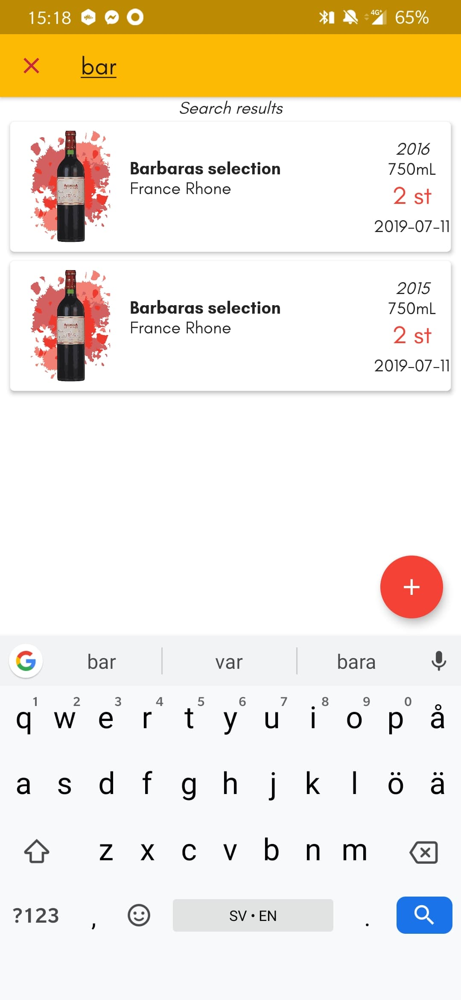
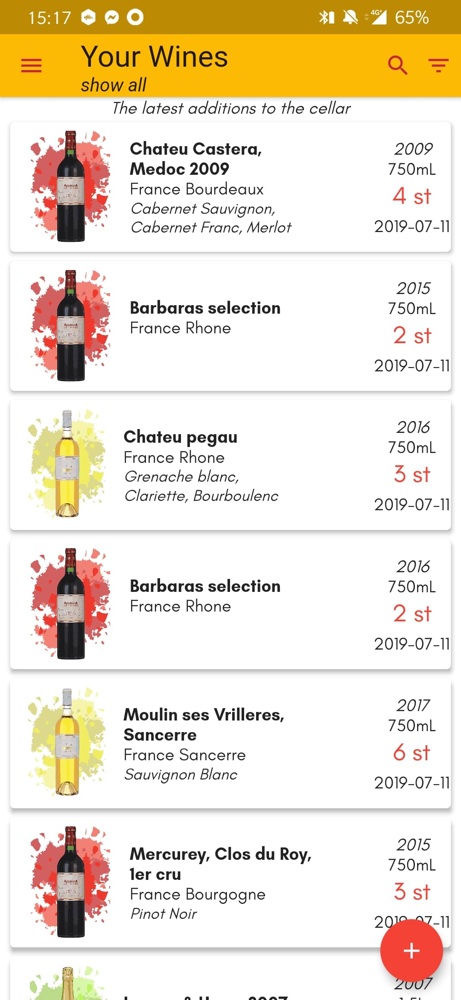

# Wine Cellar

This is an application that helps you keep track of the wines that you own.

## Features of Wine Cellar

* Easily insert wines with a variable amount of information. This includes pictures
* Autofills previously inserted wines to easily insert more wines into your cellar
* Statistics over your cellar such as total net worth, number of bottles in cellar and much more.
* Export your cellar to a csv-file that you can open in excel or google sheets for further
processing of the data
* Fully functional without internet connection and does not require an account to use
* Supports several cellars all with their own name and wines

## Screenshots
### Search &emsp; Homepage
  

